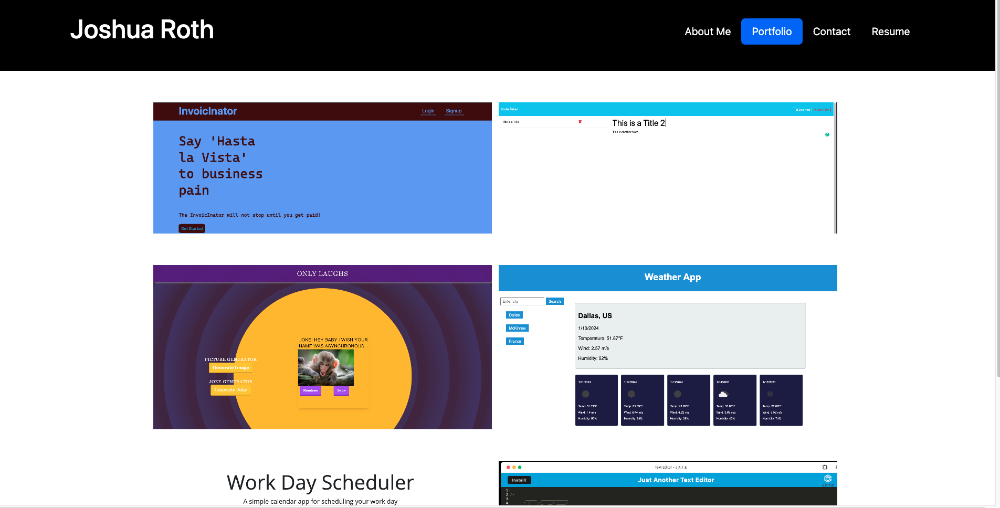

# react-portfolio

## Description
A portfolio built with react to display my projects. 

## Installation Instructions
N/A

## Table of Contents
* [Usage Information](#usage-information)
* [Screenshot](#screenshot)
* [Contributors](#contributors)
* [Test](#test)
* [Email](#email)

## Usage Information
A portfolio used to display my projects

## Deployment

## Screenshot
.

## Contributors
Bootcamp for starter code - Thanks

## Test
N/A

## Contact
https://github.com/JoshRTheDeveloper

## Email
raider4414@GMAIL.COM

## License

This project is licensed under the [MIT license](https://opensource.org/licenses/MIT).